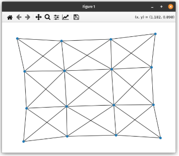

# Paul Baran Network Topologies Simulation


This project reproduces the results of Paul Baran's foundational research on network robustness using a Monte-Carlo simulation approach. It was developed as part of a lab for the **Architecture of Computer Networks** course at HEPIA.



---

## Summary
- Simulates the impact of random node failures on different network topologies.  
- Measures the resilience of topologies with increasing redundancy levels (**R = 1 to 6**).  
- Uses statistical averaging and visual plots to observe survival-rate trends.

---

## Context
Paul Baran—one of the pioneers of packet‑switched networks—showed that distributed networks are far more resilient than centralized ones. This project replicates his findings by:

- Building grids with various redundancy levels **R**  
- Randomly removing nodes (failures)  
- Measuring the largest connected component (LCC) after each failure  
- Plotting robustness vs. redundancy  

---

## Technologies Used
- **Python 3.10+**  
- **NetworkX** – graph creation & analysis  
- **NumPy** – random sampling  
- **Matplotlib** – result visualisation  

---

## Getting Started

```bash
# 1. Clone the repository
git clone https://github.com/synloop/paul-baran-network-topo.git
cd paul-baran-network-topo

# 2. Install dependencies
pip install -r requirements.txt

# 3. Run the simulation
python simulation.py
```

The script generates graphs showing survival rates as node‑failure probability increases.

---

## Project Structure
```text
.
├── simulation.py          # Monte‑Carlo simulation driver
├── print_topology.py      # Helper – visualise a given topology
├── test_breakdowns.py     # Extra script for custom experiments
├── requirements.txt
├── README.md
└── docs/
    └── report.pdf         # Full lab report (French)
```
[Read the full lab report (PDF, in French)](docs/report.pdf)

---

## Sample Results
- **R = 1 (Line topology)** : fails quickly under random removals  
- **R = 2 → R = 4** : drastic improvement in resilience  
- **R = 5 & R = 6** : diminishing returns despite extra complexity  

*Plots include error bars (standard deviation) computed over 100+ simulations.*

---

### What I Learned
* **Network resilience matters :** Paul Baran’s 1964 work showed that redundancy lets a distributed mesh survive random failures—an idea I verified in code. :contentReference[oaicite:0]{index=0}  
* **Python graph tooling :** Using NetworkX gave me hands-on practice building, analysing and visualising large graphs programmatically. :contentReference[oaicite:1]{index=1}  
* **Monte-Carlo thinking :** Running thousands of failure scenarios taught me why statistical simulation is essential for stress-testing real-world networks. :contentReference[oaicite:2]{index=2}

---

## License
Released under the **MIT License**. See the `LICENSE` file for details.

📝 Final grade received for this project: **5.8 / 6.0** (Swiss grading system)
